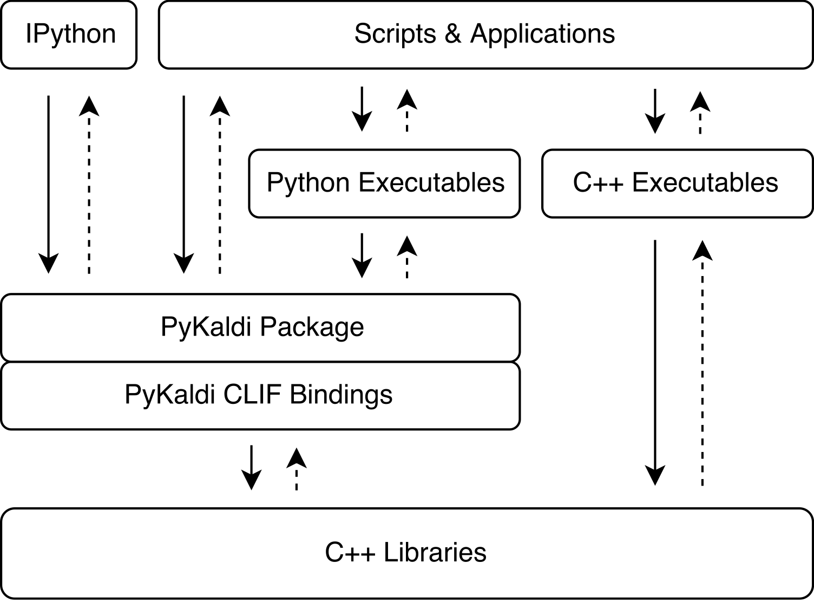

---
**NOTE**

PyKaldi is still at alpha stage. Some features might not work yet.

---

# PyKaldi

PyKaldi is a Python wrapper for [Kaldi](http://kaldi-asr.org) exposing nearly
all of Kaldi's C++ API to Python code. It aims to bridge the gap between Kaldi
and all the nice things Python has to offer including its mature ecosystem of
high quality software for scientific computing, machine learning, interactive
data exploration and visualization.

PyKaldi is more than a collection of bindings into Kaldi libraries. It is a
scripting layer providing first class support for essential Kaldi and
[OpenFst](http://www.openfst.org) types in Python. PyKaldi vector and matrix
types are tightly integrated with [NumPy](http://www.numpy.org). They can be
seamlessly converted to NumPy arrays and vice versa without copying the
underlying memory buffers. PyKaldi FST types, including Kaldi style lattices,
are first class citizens in Python. The API for the user facing FST types and
operations is almost entirely defined in Python mimicking the API exposed by
[pywrapfst](http://www.openfst.org/twiki/bin/view/FST/PythonExtension), the
official Python wrapper for OpenFst.

You can read more about the design and technical details of PyKaldi in
[our paper](https://github.com/pykaldi/pykaldi/blob/master/docs/pykaldi.pdf).

## Features

* Near-complete coverage of Kaldi's C++ API

* First class support for Kaldi and OpenFst types in Python

* Extensible design

* Open license

* Extensive documentation

* Thorough testing

* Example scripts

* Support for both Python 2.7 and 3.5+


## Overview

- [About PyKaldi](#about-pykaldi)
  - [Coverage Status](#coverage-status)
- [Getting Started](#getting-started)
- [Installation](#installation)
  - [Docker Image](#docker-image)
  - [From Source](#from-source)
- [Contributing](#contributing)


## About PyKaldi

PyKaldi harnesses the power of [CLIF](https://github.com/google/clif) to wrap
Kaldi C++ libraries using simple API descriptions. The CPython extension modules
generated by CLIF can be imported in Python to interact with Kaldi. While CLIF
is great for exposing the existing C++ API in Python, the wrappers do not always
expose a "Pythonic" API that is easy to use from Python. To address this
concern, PyKaldi extends the raw CLIF wrappers in Python (and sometimes in C++)
to provide a more "Pythonic" API. Below figure illustrates where PyKaldi fits in
the Kaldi software architecture.

<p align="center">

</p>

PyKaldi has a modular design which makes it easy to maintain and extend. Source
files are organized in a directory tree that is a replica of the Kaldi source
tree. Each directory defines a subpackage and contains only the wrapper code
written for the associated Kaldi library. The wrapper code consists of:

* CLIF C++ API descriptions defining the types and functions to be wrapped and
  their Python API,

* C++ headers defining the shims for Kaldi code that is not compliant with the
  Google C++ style expected by CLIF,

* Python modules grouping together related extension modules generated with CLIF
  and extending the raw CLIF wrappers to provide a more "Pythonic" API.

### Coverage Status

The following table shows the status of each PyKaldi package along the following
dimensions:

* __Wrapped?__: If there are enough .clif files to make the package usable in
  Python.
* __Pythonic?__: If the package API has a "Pythonic" look-and-feel.
* __Documentation?__: If there is documentation beyond what is automatically
  generated by CLIF. Single checkmark indicates that there is not much additional
  documentation (if any). Three checkmarks indicates that package documentation
  is complete (or near complete).
* __Tests?__: If there are tests for the package.

| Package    | Wrapped? | Pythonic? | Documentation?             | Tests?   |
| :--------: | :------: | :-------: | :------------------------: | :------: |
| base       | &#10004; | &#10004;  | &#10004; &#10004;          | &#10004; |
| chain      | &#10004; |           | &#10004;                   |          |
| cudamatrix | &#10004; |           | &#10004;                   | &#10004; |
| decoder    | &#10004; | &#10004;  | &#10004; &#10004; &#10004; |          |
| feat       | &#10004; | &#10004;  | &#10004;                   |          |
| fstext     | &#10004; | &#10004;  | &#10004; &#10004; &#10004; |          |
| gmm        | &#10004; | &#10004;  | &#10004; &#10004;          | &#10004; |
| hmm        | &#10004; | &#10004;  | &#10004;                   | &#10004; |
| itf        | &#10004; |           | &#10004;                   |          |
| ivector    | &#10004; |           | &#10004;                   |          |
| kws        | &#10004; | &#10004;  | &#10004; &#10004; &#10004; |          |
| lat        | &#10004; |           | &#10004; &#10004; &#10004; |          |
| lm         | &#10004; |           | &#10004;                   |          |
| matrix     | &#10004; | &#10004;  | &#10004; &#10004; &#10004; | &#10004; |
| nnet       |          |           |                            |          |
| nnet2      |          |           |                            |          |
| nnet3      | &#10004; |           | &#10004;                   | &#10004; |
| online     |          |           |                            |          |
| online2    | &#10004; |           | &#10004;                   |          |
| rnnlm      | &#10004; | &#10004;  | &#10004; &#10004; &#10004; |          |
| sgmm2      | &#10004; |           | &#10004;                   |          |
| tfrnnlm    | &#10004; |           | &#10004; &#10004;          |          |
| transform  | &#10004; | &#10004;  | &#10004;                   |          |
| tree       | &#10004; |           | &#10004;                   |          |
| util       | &#10004; | &#10004;  | &#10004; &#10004; &#10004; | &#10004; |

## Getting Started

Some places to help you get started:

* [PyKaldi Documentation](https://pykaldi.github.io)
* [PyKaldi Examples](https://github.com/pykaldi/pykaldi/tree/master/examples/)


## Installing PyKaldi from Source

To install PyKaldi from source, follow the steps given below.

### Step 1: Clone PyKaldi Repository and Create a new Python Environment

```bash
git clone https://github.com/pykaldi/pykaldi.git
cd pykaldi
```

Although it is not required, we recommend installing PyKaldi and all of its
Python dependencies inside a new isolated Python environment. If you do not want
to create a new Python environment, you can skip the rest of this step.

You can use any tool you like for creating a new Python environment. Here we
use `virtualenv`, but you can use another tool like `conda` if you prefer that.
Make sure you activate the new Python environment before continuing with the
rest of the installation.

```bash
virtualenv env
source env/bin/activate
```

### Step 2: Install Dependencies

On Ubuntu 16.04, running the following commands will install system packages
needed for building PyKaldi from source.

```bash
sudo apt-get install autoconf automake cmake curl g++ git libatlas3-base \
    libtool make pkg-config subversion unzip wget zlib1g-dev

pip install --upgrade pip
pip install --upgrade setuptools
pip install numpy pyparsing
pip install ninja  # not required but strongly recommended
```

In addition to above listed system packages, we also need PyKaldi compatible
installations of the following software:

* [Google Protobuf](https://github.com/google/protobuf.git) v3.2 or later. Both
the C++ library and the Python package must be installed.

* [PyKaldi compatible fork of CLIF](https://github.com/pykaldi/clif). To
streamline PyKaldi development, we made some changes to CLIF codebase. We
are hoping to upstream these changes over time.

* [PyKaldi compatible fork of Kaldi](https://github.com/pykaldi/kaldi). To
comply with CLIF requirements we had to make some changes to Kaldi codebase. We
are hoping to upstream these changes over time.

You can use the scripts in the `tools` directory to install these software
locally.

```bash
cd tools
./check_dependencies.sh  # checks if system dependencies are installed
./install_protobuf.sh    # installs both the C++ library and the Python package
./install_clif.sh        # installs both the C++ library and the Python package
./install_kaldi.sh       # installs the C++ library
cd ..
```

### Step 3: Install PyKaldi

If Kaldi is installed inside the `tools` directory and all Python dependencies
(numpy, pyparsing, pyclif, protobuf) are installed in the active Python
environment, you can install PyKaldi with the following command.

```bash
python setup.py install
```

## PyKaldi Docker Image

We provide a `Dockerfile` in the `docker` directory for building a new image.

```bash
cd pykaldi/docker
docker build -t pykaldi .
```

Alternatively, a pre-built image can be downloaded from dockerhub.

```bash
docker login
docker pull vrmpx/pykaldi
```

After building/downloading the image, you can run it in interactive mode.

```bash
sudo docker run -it pykaldi
```

## FAQ

### How do I build PyKaldi on MacOS?

At the moment, PyKaldi installation scripts do not work on non-Linux platforms.
It should not be too hard to get them to work on MacOS but we haven't yet looked
into it.

### How do I build PyKaldi on Windows?

We have no idea what is needed to build PyKaldi on Windows. We have no intention
of adding Windows support in the foreseeable future.

### How do I build PyKaldi using a different Kaldi installation?

At the moment, PyKaldi is not compatible with the upstream Kaldi repository.
You need to build it against [our Kaldi fork](https://github.com/pykaldi/kaldi).

If you already have a compatible Kaldi installation on your system, you do not
need to install a new one inside the `pykaldi/tools` directory. Instead, you
can simply set the following environment variable before running the PyKaldi
installation command.

```bash
export KALDI_DIR=<directory where Kaldi is installed, e.g. "$HOME/tools/kaldi">
```

### How do I build PyKaldi using a different CLIF installation?

At the moment, PyKaldi is not compatible with the upstream CLIF repository.
You need to build it using [our CLIF fork](https://github.com/pykaldi/clif).

If you already have a compatible CLIF installation on your system, you do not
need to install a new one inside the `pykaldi/tools` directory. Instead, you
can simply set the following environment variables before running the PyKaldi
installation command.

```bash
export PYCLIF=<path to pyclif executable, e.g. "$HOME/anaconda3/envs/clif/bin/pyclif">
export CLIF_MATCHER=<path to clif-matcher executable, e.g. "$HOME/anaconda3/envs/clif/clang/bin/clif-matcher">
```


## Citing
If you use PyKaldi for research, please cite
[our paper](https://github.com/pykaldi/pykaldi/blob/master/docs/pykaldi.pdf)
as follows:

```
@inproceedings{pykaldi,
  title = {PyKaldi: A Python Wrapper for Kaldi},
  author = {Doğan Can and Victor R. Martinez and Pavlos Papadopoulos and
            Shrikanth S. Narayanan},
  booktitle={Acoustics, Speech and Signal Processing (ICASSP),
             2018 IEEE International Conference on},
  year = {2018},
  organization = {IEEE}
}
```


## Contributing

We appreciate all contributions! If you find a bug, feel free to open an issue
or a pull request. If you would like to add, extend or request a feature,
please open an issue for discussion.
