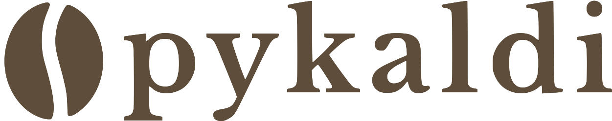

<p align="center"></p>

--------------------------------------------------------------------------------

[![Build Status]][Travis]

PyKaldi is a Python scripting layer for the [Kaldi] speech recognition toolkit.
It provides easy-to-use, low-overhead, first-class Python wrappers for the C++
code in Kaldi and [OpenFst] libraries. You can use PyKaldi to write Python code
for things that would otherwise require writing C++ code such as calling
low-level Kaldi functions, manipulating Kaldi and OpenFst objects in code or
implementing new Kaldi tools.

You can think of Kaldi as a large box of legos that you can mix and match to
build custom speech recognition solutions. The best way to think of PyKaldi is
as a supplement, a sidekick if you will, to Kaldi. In fact, PyKaldi is at its
best when it is used alongside Kaldi. To that end, replicating the functionality
of myriad command-line tools, utility scripts and shell-level recipes provided
by Kaldi is a non-goal for the PyKaldi project.


## Overview

- [Getting Started](#getting-started)
- [About PyKaldi](#about-pykaldi)
- [Coverage Status](#coverage-status)
- [Installation](#installation)
- [FAQ](#faq)
- [Citing](#citing)
- [Contributing](#contributing)


## Getting Started

Like Kaldi, PyKaldi is primarily intended for speech recognition researchers and
professionals. It is jam packed with goodies that one would need to build Python
software taking advantage of the vast collection of utilities, algorithms and
data structures provided by Kaldi and OpenFst libraries.

If you are not familiar with FST-based speech recognition or have no interest in
having access to the guts of Kaldi and OpenFst in Python, but only want to run a
pre-trained Kaldi system as part of your Python application, do not fret.
PyKaldi includes a number of high-level application oriented modules, such as
[`asr`], [`alignment`] and [`segmentation`], that should be accessible to most
Python programmers.

If you are interested in using PyKaldi for research or building advanced ASR
applications, you are in luck. PyKaldi comes with everything you need to read,
write, inspect, manipulate or visualize Kaldi and OpenFst objects in Python. It
includes Python wrappers for most functions and methods that are part of the
public APIs of Kaldi and OpenFst C++ libraries. If you want to read/write files
that are produced/consumed by Kaldi tools, check out I/O and table utilities in
the [`util`] package. If you want to work with Kaldi matrices and vectors, e.g.
convert them to [NumPy] ndarrays and vice versa, check out the [`matrix`]
package. If you want to use Kaldi for feature extraction and transformation,
check out the [`feat`], [`ivector`] and [`transform`] packages. If you want to
work with lattices or other FST structures produced/consumed by Kaldi tools,
check out the [`fstext`], [`lat`] and [`kws`] packages. If you want low-level
access to Gaussian mixture models, hidden Markov models or phonetic decision
trees in Kaldi, check out the [`gmm`], [`sgmm2`], [`hmm`], and [`tree`]
packages. If you want low-level access to Kaldi neural network models, check out
the [`nnet3`], [`cudamatrix`] and [`chain`] packages. If you want to use the
decoders and language modeling utilities in Kaldi, check out the [`decoder`],
[`lm`], [`rnnlm`], [`tfrnnlm`] and [`online2`] packages.

Interested readers who would like to learn more about Kaldi and PyKaldi might
find the following resources useful:

* [Kaldi Docs]: Read these to learn more about Kaldi.
* [PyKaldi Docs]: Consult these to learn more about the PyKaldi API.
* [PyKaldi Examples]: Check these out to see PyKaldi in action.
* [PyKaldi Paper]: Read this to learn more about the design of PyKaldi.

Since automatic speech recognition (ASR) in Python is undoubtedly the "killer
app" for PyKaldi, we will go over a few ASR scenarios to get a feel for the
PyKaldi API. We should note that PyKaldi does not provide any high-level
utilities for training ASR models, so you need to train your models using Kaldi
recipes or use pre-trained models available online. The reason why this is so is
simply because there is no high-level ASR training API in Kaldi C++ libraries.
Kaldi ASR models are trained using complex shell-level [recipes][Kaldi Recipes]
that handle everything from data preparation to the orchestration of myriad
Kaldi executables used in training. This is by design and unlikely to change in
the future. PyKaldi does provide wrappers for the low-level ASR training
utilities in Kaldi C++ libraries but those are not really useful unless you want
to build an ASR training pipeline in Python from basic building blocks, which is
no easy task. Continuing with the lego analogy, this task is akin to building
[this][Lego Chiron] given access to a truck full of legos you might need. If you
are crazy enough to try though, please don't let this paragraph discourage you.
Before we started building PyKaldi, we thought that was a mad man's task too.

### Automatic Speech Recognition in Python

PyKaldi [`asr`] module includes a number of easy-to-use, high-level classes to
make it dead simple to put together ASR systems in Python. Ignoring the
boilerplate code needed for setting things up, doing ASR with PyKaldi can be as
simple as the following snippet of code:

```python
asr = SomeRecognizer.from_files("final.mdl", "HCLG.fst", "words.txt", opts)

with SequentialMatrixReader("ark:feats.ark") as feats_reader:
    for key, feats in feats_reader:
        out = asr.decode(feats)
        print(key, out["text"])
```

In this simplified example, we first instantiate a hypothetical recognizer
`SomeRecognizer` with the paths for the model `final.mdl`, the decoding graph
`HCLG.fst` and the symbol table `words.txt`. The `opts` object contains the
configuration options for the recognizer. Then, we instantiate a [PyKaldi table
reader][`util.table`] `SequentialMatrixReader` for reading the feature
matrices stored in the [Kaldi archive][Kaldi Archive Docs] `feats.ark`. Finally,
we iterate over the feature matrices and decode them one by one. Here we are
simply printing the best ASR hypothesis for each utterance so we are only
interested in the `"text"` entry of the output dictionary `out`. Keep in mind
that the output dictionary contains a bunch of other useful entries, such as the
frame level alignment of the best hypothesis and a weighted lattice representing
the most likely hypotheses. Admittedly, not all ASR pipelines will be as simple
as this example, but they will often have the same overall structure. In the
following sections, we will see how we can adapt the code given above to
implement more complicated ASR pipelines.


#### Offline ASR using Kaldi Models

This is the most common scenario. We want to do offline ASR using pre-trained
Kaldi models, such as [ASpIRE chain models]. Here we are using the term "models"
loosely to refer to everything one would need to put together an ASR system. In
this specific example, we are going to need:

* a [neural network acoustic model][Kaldi Neural Network Docs],
* a [transition model][Kaldi Transition Model Docs],
* a [decoding graph][Kaldi Decoding Graph Docs],
* a [word symbol table][Kaldi Symbol Table Docs],
* and a couple of feature extraction [configs][Kaldi Config Docs].

Note that you can use this example code to decode with [ASpIRE chain models].

```python
from kaldi.asr import NnetLatticeFasterRecognizer
from kaldi.decoder import LatticeFasterDecoderOptions
from kaldi.nnet3 import NnetSimpleComputationOptions
from kaldi.util.table import SequentialMatrixReader, CompactLatticeWriter

# Set the paths and read/write specifiers
model_path = "models/aspire/final.mdl"
graph_path = "models/aspire/graph_pp/HCLG.fst"
symbols_path = "models/aspire/graph_pp/words.txt"
feats_rspec = ("ark:compute-mfcc-feats --config=models/aspire/conf/mfcc.conf "
               "scp:wav.scp ark:- |")
ivectors_rspec = (feats_rspec + "ivector-extract-online2 "
                  "--config=models/aspire/conf/ivector_extractor.conf "
                  "ark:spk2utt ark:- ark:- |")
lat_wspec = "ark:| gzip -c > lat.gz"

# Instantiate the recognizer
decoder_opts = LatticeFasterDecoderOptions()
decoder_opts.beam = 13
decoder_opts.max_active = 7000
decodable_opts = NnetSimpleComputationOptions()
decodable_opts.acoustic_scale = 1.0
decodable_opts.frame_subsampling_factor = 3
asr = NnetLatticeFasterRecognizer.from_files(
    model_path, graph_path, symbols_path,
    decoder_opts=decoder_opts, decodable_opts=decodable_opts)

# Extract the features, decode and write output lattices
with SequentialMatrixReader(feats_rspec) as feats_reader, \
     SequentialMatrixReader(ivectors_rspec) as ivectors_reader, \
     CompactLatticeWriter(lat_wspec) as lat_writer:
    for (fkey, feats), (ikey, ivectors) in zip(feats_reader, ivectors_reader):
        assert(fkey == ikey)
        out = asr.decode((feats, ivectors))
        print(fkey, out["text"])
        lat_writer[fkey] = out["lattice"]
```

The fundamental difference between this example and the short snippet from last
section is that for each utterance we are reading the raw audio data from disk
and computing two feature matrices on the fly instead of reading a single
precomputed feature matrix from disk. The [script file][Kaldi Script File Docs]
`wav.scp` contains a list of WAV files corresponding to the utterances we want
to decode. The additional feature matrix we are extracting contains online
i-vectors that are used by the neural network acoustic model to perform channel
and speaker adaptation. The [speaker-to-utterance map][Kaldi Data Docs]
`spk2utt` is used for accumulating separate statistics for each speaker in
online i-vector extraction. It can be a simple identity mapping if the speaker
information is not available. We pack the MFCC features and the i-vectors into a
tuple and pass this tuple to the recognizer for decoding. The neural network
recognizers in PyKaldi know how to handle the additional i-vector features when
they are available. The model file `final.mdl` contains both the transition
model and the neural network acoustic model. The `NnetLatticeFasterRecognizer`
processes feature matrices by first computing phone log-likelihoods using the
neural network acoustic model, then mapping those to transition log-likelihoods
using the transition model and finally decoding transition log-likelihoods into
word sequences using the decoding graph `HCLG.fst`, which has [transition
IDs][Kaldi Transition Model Docs] on its input labels and [word IDs][Kaldi
Symbol Table Docs] on its output labels. After decoding, we save the lattice
generated by the recognizer to a Kaldi archive for future processing.

This example also illustrates the powerful [I/O mechanisms][Kaldi I/O Docs]
provided by Kaldi. Instead of implementing the feature extraction pipelines in
code, we define them as Kaldi read specifiers and compute the feature matrices
simply by instantiating [PyKaldi table readers][`util.table`] and
iterating over them. This is not only the simplest but also the fastest way of
computing features with PyKaldi since the feature extraction pipeline is run in
parallel by the operating system. Similarly, we use a Kaldi write specifier to
instantiate a [PyKaldi table writer][`util.table`] which writes output
lattices to a compressed Kaldi archive. Note that for these to work, we need
`compute-mfcc-feats`, `ivector-extract-online2` and `gzip` to be on our `PATH`.

#### Offline ASR using a PyTorch Acoustic Model

This is similar to the previous scenario, but instead of a Kaldi acoustic model,
we use a [PyTorch] acoustic model. After computing the features as before, we
convert them to a PyTorch tensor, do the forward pass using a PyTorch neural
network module outputting phone log-likelihoods and finally convert those
log-likelihoods back into a PyKaldi matrix for decoding. The recognizer uses the
transition model to automatically map phone IDs to transition IDs, the input
labels on a typical Kaldi decoding graph.

```python
from kaldi.asr import MappedLatticeFasterRecognizer
from kaldi.decoder import LatticeFasterDecoderOptions
from kaldi.matrix import Matrix
from kaldi.util.table import SequentialMatrixReader, CompactLatticeWriter
from models import AcousticModel  # Import your PyTorch model
import torch

# Set the paths and read/write specifiers
acoustic_model_path = "models/aspire/model.pt"
transition_model_path = "models/aspire/final.mdl"
graph_path = "models/aspire/graph_pp/HCLG.fst"
symbols_path = "models/aspire/graph_pp/words.txt"
feats_rspec = ("ark:compute-mfcc-feats --config=models/aspire/conf/mfcc.conf "
               "scp:wav.scp ark:- |")
lat_wspec = "ark:| gzip -c > lat.gz"

# Instantiate the recognizer
decoder_opts = LatticeFasterDecoderOptions()
decoder_opts.beam = 13
decoder_opts.max_active = 7000
asr = MappedLatticeFasterRecognizer.from_files(
    transition_model_path, graph_path, symbols_path, decoder_opts=decoder_opts)

# Instantiate the PyTorch acoustic model (subclass of torch.nn.Module)
model = AcousticModel(...)
model.load_state_dict(torch.load(acoustic_model_path))
model.eval()

# Extract the features, decode and write output lattices
with SequentialMatrixReader(feats_rspec) as feats_reader, \
     CompactLatticeWriter(lat_wspec) as lat_writer:
    for key, feats in feats_reader:
        feats = torch.from_numpy(feats.numpy())  # Convert to PyTorch tensor
        loglikes = model(feats)                  # Compute log-likelihoods
        loglikes = Matrix(loglikes.numpy())      # Convert to PyKaldi matrix
        out = asr.decode(loglikes)
        print(key, out["text"])
        lat_writer[key] = out["lattice"]
```

#### Online ASR using Kaldi Models

This section is a placeholder. Check out [this script][PyKaldi Online ASR
Example] in the meantime.

#### Lattice Rescoring with a Kaldi RNNLM

Lattice rescoring is a standard technique for using large n-gram language models
or recurrent neural network language models (RNNLMs) in ASR. In this example, we
rescore lattices using a Kaldi RNNLM. We first instantiate a rescorer by
providing the paths for the models. Then we use a table reader to iterate over
the lattices we want to rescore and finally we use a table writer to write
rescored lattices back to disk.

```python
from kaldi.asr import LatticeRnnlmPrunedRescorer
from kaldi.fstext import SymbolTable
from kaldi.rnnlm import RnnlmComputeStateComputationOptions
from kaldi.util.table import SequentialCompactLatticeReader, CompactLatticeWriter

# Set the paths, extended filenames and read/write specifiers
symbols_path = "models/tedlium/config/words.txt"
old_lm_path = "models/tedlium/data/lang_nosp/G.fst"
word_feats_path = "models/tedlium/word_feats.txt"
feat_embedding_path = "models/tedlium/feat_embedding.final.mat"
word_embedding_rxfilename = ("rnnlm-get-word-embedding %s %s - |"
                             % (word_feats_path, feat_embedding_path))
rnnlm_path = "models/tedlium/final.raw"
lat_rspec = "ark:gunzip -c lat.gz |"
lat_wspec = "ark:| gzip -c > rescored_lat.gz"

# Instantiate the rescorer
symbols = SymbolTable.read_text(symbols_path)
opts = RnnlmComputeStateComputationOptions()
opts.bos_index = symbols.find_index("<s>")
opts.eos_index = symbols.find_index("</s>")
opts.brk_index = symbols.find_index("<brk>")
rescorer = LatticeRnnlmPrunedRescorer.from_files(
    old_lm_path, word_embedding_rxfilename, rnnlm_path, opts=opts)

# Read the lattices, rescore and write output lattices
with SequentialCompactLatticeReader(lat_rspec) as lat_reader, \
     CompactLatticeWriter(lat_wspec) as lat_writer:
  for key, lat in lat_reader:
    lat_writer[key] = rescorer.rescore(lat)
```

Notice the extended filename we used to compute the word embeddings from the
word features and the feature embeddings on the fly. Also of note are the
read/write specifiers we used to transparently decompress/compress the lattice
archives. For these to work, we need `rnnlm-get-word-embedding`, `gunzip` and
`gzip` to be on our `PATH`.


## About PyKaldi

PyKaldi aims to bridge the gap between Kaldi and all the nice things Python has
to offer. It is more than a collection of bindings into Kaldi libraries. It is a
scripting layer providing first class support for essential Kaldi and [OpenFst]
types in Python. PyKaldi vector and matrix types are tightly integrated with
[NumPy]. They can be seamlessly converted to NumPy arrays and vice versa without
copying the underlying memory buffers. PyKaldi FST types, including Kaldi style
lattices, are first class citizens in Python. The API for the user facing FST
types and operations is almost entirely defined in Python mimicking the API
exposed by [pywrapfst], the official Python wrapper for OpenFst.

PyKaldi harnesses the power of [CLIF] to wrap Kaldi and OpenFst C++ libraries
using simple API descriptions. The CPython extension modules generated by CLIF
can be imported in Python to interact with Kaldi and OpenFst. While CLIF is
great for exposing existing C++ API in Python, the wrappers do not always expose
a "Pythonic" API that is easy to use from Python. PyKaldi addresses this by
extending the raw CLIF wrappers in Python (and sometimes in C++) to provide a
more "Pythonic" API. Below figure illustrates where PyKaldi fits in the Kaldi
ecosystem.

<p align="center">

</p>

PyKaldi has a modular design which makes it easy to maintain and extend. Source
files are organized in a directory tree that is a replica of the Kaldi source
tree. Each directory defines a subpackage and contains only the wrapper code
written for the associated Kaldi library. The wrapper code consists of:

* CLIF C++ API descriptions defining the types and functions to be wrapped and
  their Python API,

* C++ headers defining the shims for Kaldi code that is not compliant with the
  Google C++ style expected by CLIF,

* Python modules grouping together related extension modules generated with CLIF
  and extending the raw CLIF wrappers to provide a more "Pythonic" API.

You can read more about the design and technical details of PyKaldi in
[our paper][PyKaldi Paper].

## Coverage Status

The following table shows the status of each PyKaldi package (we currently do
not plan to add support for nnet, nnet2 and online) along the following
dimensions:

* __Wrapped?__: If there are enough CLIF files to make the package usable in
  Python.
* __Pythonic?__: If the package API has a "Pythonic" look-and-feel.
* __Documentation?__: If there is documentation beyond what is automatically
  generated by CLIF. Single checkmark indicates that there is not much additional
  documentation (if any). Three checkmarks indicates that package documentation
  is complete (or near complete).
* __Tests?__: If there are any tests for the package.

| Package    | Wrapped? | Pythonic? | Documentation?             | Tests?   |
| :--------: | :------: | :-------: | :------------------------: | :------: |
| base       | &#10004; | &#10004;  | &#10004; &#10004; &#10004; | &#10004; |
| chain      | &#10004; | &#10004;  | &#10004; &#10004; &#10004; |          |
| cudamatrix | &#10004; |           | &#10004;                   | &#10004; |
| decoder    | &#10004; | &#10004;  | &#10004; &#10004; &#10004; |          |
| feat       | &#10004; | &#10004;  | &#10004; &#10004; &#10004; |          |
| fstext     | &#10004; | &#10004;  | &#10004; &#10004; &#10004; |          |
| gmm        | &#10004; | &#10004;  | &#10004; &#10004;          | &#10004; |
| hmm        | &#10004; | &#10004;  | &#10004; &#10004; &#10004; | &#10004; |
| ivector    | &#10004; |           | &#10004;                   |          |
| kws        | &#10004; | &#10004;  | &#10004; &#10004; &#10004; |          |
| lat        | &#10004; | &#10004;  | &#10004; &#10004; &#10004; |          |
| lm         | &#10004; | &#10004;  | &#10004; &#10004; &#10004; |          |
| matrix     | &#10004; | &#10004;  | &#10004; &#10004; &#10004; | &#10004; |
| nnet3      | &#10004; |           | &#10004;                   | &#10004; |
| online2    | &#10004; | &#10004;  | &#10004; &#10004; &#10004; |          |
| rnnlm      | &#10004; | &#10004;  | &#10004; &#10004; &#10004; |          |
| sgmm2      | &#10004; |           | &#10004;                   |          |
| tfrnnlm    | &#10004; | &#10004;  | &#10004; &#10004; &#10004; |          |
| transform  | &#10004; | &#10004;  | &#10004;                   |          |
| tree       | &#10004; |           | &#10004;                   |          |
| util       | &#10004; | &#10004;  | &#10004; &#10004; &#10004; | &#10004; |


## Installation

If you are using a relatively recent Linux or macOS, such as Ubuntu >= 16.04,
CentOS >= 7 or macOS >= 10.13, you should be able to install PyKaldi without too
much trouble. Otherwise, you will likely need to tweak the installation scripts.

### Conda

To install PyKaldi with CUDA support:

```bash
conda install -c pykaldi pykaldi
```

To install PyKaldi without CUDA support (CPU only):

```bash
conda install -c pykaldi pykaldi-cpu
```

Note that PyKaldi conda package does not provide Kaldi executables. If you would
like to use Kaldi executables along with PyKaldi, e.g. as part of read/write
specifiers, you need to install Kaldi separately.

### Docker

If you would like to use PyKaldi inside a Docker container, follow the
instructions in the `docker` folder.

### From Source

To install PyKaldi from source, follow the steps given below.

#### Step 1: Clone PyKaldi Repository and Create a New Python Environment

```bash
git clone https://github.com/pykaldi/pykaldi.git
cd pykaldi
```

Although it is not required, we recommend installing PyKaldi and all of its
Python dependencies inside a new isolated Python environment. If you do not want
to create a new Python environment, you can skip the rest of this step.

You can use any tool you like for creating a new Python environment. Here we
use `virtualenv`, but you can use another tool like `conda` if you prefer that.
Make sure you activate the new Python environment before continuing with the
rest of the installation.

```bash
virtualenv env
source env/bin/activate
```

#### Step 2: Install Dependencies

Running the commands below will install the system packages needed for building
PyKaldi from source.

```bash
# Ubuntu
sudo apt-get install autoconf automake cmake curl g++ git graphviz \
    libatlas3-base libtool make pkg-config subversion unzip wget zlib1g-dev

# macOS
brew install automake cmake git graphviz libtool pkg-config wget
```

Running the commands below will install the Python packages needed for building
PyKaldi from source.

```bash
pip install --upgrade pip
pip install --upgrade setuptools
pip install numpy pyparsing
pip install ninja  # not required but strongly recommended
```

In addition to above listed packages, we also need PyKaldi compatible
installations of the following software:

* [Google Protobuf](https://github.com/google/protobuf.git) v3.2 or later. Both
the C++ library and the Python package must be installed.

* [PyKaldi compatible fork of CLIF](https://github.com/pykaldi/clif). To
streamline PyKaldi development, we made some changes to CLIF codebase. We
are hoping to upstream these changes over time.

* [PyKaldi compatible fork of Kaldi](https://github.com/pykaldi/kaldi). To
comply with CLIF requirements we had to make some changes to Kaldi codebase. We
are hoping to upstream these changes over time.

You can use the scripts in the `tools` directory to install or update these
software locally. Make sure you check the output of these scripts. If you do not
see `Done installing {protobuf,CLIF,Kaldi}` printed at the very end, it means
that installation has failed for some reason.

```bash
cd tools
./check_dependencies.sh  # checks if system dependencies are installed
./install_protobuf.sh    # installs both the C++ library and the Python package
./install_clif.sh        # installs both the C++ library and the Python package
./install_kaldi.sh       # installs the C++ library
cd ..
```

#### Step 3: Install PyKaldi

If Kaldi is installed inside the `tools` directory and all Python dependencies
(numpy, pyparsing, pyclif, protobuf) are installed in the active Python
environment, you can install PyKaldi with the following command.

```bash
python setup.py install
```

Once installed, you can run PyKaldi tests with the following command.

```bash
python setup.py test
```


## FAQ

### How do I prevent PyKaldi install command from exhausting the system memory?

By default, PyKaldi install command uses all available (logical) processors to
accelerate the build process. If the size of the system memory is relatively
small compared to the number of processors, the parallel compilation/linking
jobs might end up exhausting the system memory and result in swapping. You can
limit the number of parallel jobs used for building PyKaldi as follows:

```bash
MAKE_NUM_JOBS=2 python setup.py install
```

### How do I build PyKaldi on Windows?

We have no idea what is needed to build PyKaldi on Windows. It would probably
require lots of changes to the build system.

### How do I build PyKaldi using a different Kaldi installation?

At the moment, PyKaldi is not compatible with the upstream Kaldi repository.
You need to build it against [our Kaldi fork](https://github.com/pykaldi/kaldi).

If you already have a compatible Kaldi installation on your system, you do not
need to install a new one inside the `pykaldi/tools` directory. Instead, you
can simply set the following environment variable before running the PyKaldi
installation command.

```bash
export KALDI_DIR=<directory where Kaldi is installed, e.g. "$HOME/tools/kaldi">
```

### How do I build PyKaldi using a different CLIF installation?

At the moment, PyKaldi is not compatible with the upstream CLIF repository.
You need to build it using [our CLIF fork](https://github.com/pykaldi/clif).

If you already have a compatible CLIF installation on your system, you do not
need to install a new one inside the `pykaldi/tools` directory. Instead, you
can simply set the following environment variables before running the PyKaldi
installation command.

```bash
export PYCLIF=<path to pyclif executable, e.g. "$HOME/anaconda3/envs/clif/bin/pyclif">
export CLIF_MATCHER=<path to clif-matcher executable, e.g. "$HOME/anaconda3/envs/clif/clang/bin/clif-matcher">
```

### How do I update Protobuf, CLIF or Kaldi used by PyKaldi?

While the need for updating Protobuf and CLIF should not come up very often, you
might want or need to update Kaldi installation used for building PyKaldi.
Rerunning the relevant install script in `tools` directory should update the
existing installation. If this does not work, please open an issue.

### How do I build PyKaldi with Tensorflow RNNLM support?

PyKaldi `tfrnnlm` package is built automatically along with the rest of PyKaldi
if `kaldi-tensorflow-rnnlm` library can be found among Kaldi libraries. After
building Kaldi, go to `KALDI_DIR/src/tfrnnlm/` directory and follow the
instructions given in the Makefile. Make sure the symbolic link for the
`kaldi-tensorflow-rnnlm` library is added to the `KALDI_DIR/src/lib/` directory.


## Citing

If you use PyKaldi for research, please cite [our paper][PyKaldi Paper] as
follows:

```
@inproceedings{pykaldi,
  title = {PyKaldi: A Python Wrapper for Kaldi},
  author = {Dogan Can and Victor R. Martinez and Pavlos Papadopoulos and
            Shrikanth S. Narayanan},
  booktitle={Acoustics, Speech and Signal Processing (ICASSP),
             2018 IEEE International Conference on},
  year = {2018},
  organization = {IEEE}
}
```


## Contributing

We appreciate all contributions! If you find a bug, feel free to open an issue
or a pull request. If you would like to request or add a new feature please open
an issue for discussion.


[ASpIRE chain models]: http://kaldi-asr.org/models/m1
[Build Status]: https://travis-ci.org/pykaldi/pykaldi.svg?branch=master
[CLIF]: https://github.com/google/clif
[Kaldi]: https://github.com/kaldi-asr/kaldi
[Kaldi Recipes]: https://github.com/kaldi-asr/kaldi/tree/master/egs
[Kaldi Docs]: http://kaldi-asr.org/doc/
[Kaldi Script File Docs]: http://kaldi-asr.org/doc/io.html#io_sec_scp
[Kaldi Archive Docs]: http://kaldi-asr.org/doc/io.html#io_sec_archive
[Kaldi Transition Model Docs]: http://kaldi-asr.org/doc/hmm.html#transition_model
[Kaldi Neural Network Docs]: http://kaldi-asr.org/doc/dnn3.html
[Kaldi Decoding Graph Docs]: http://kaldi-asr.org/doc/graph.html
[Kaldi Symbol Table Docs]: http://kaldi-asr.org/doc/data_prep.html#data_prep_lang_contents
[Kaldi Data Docs]: http://kaldi-asr.org/doc/data_prep.html#data_prep_data
[Kaldi Config Docs]: http://kaldi-asr.org/doc/parse_options.html#parse_options_implicit
[Kaldi I/O Docs]: http://kaldi-asr.org/doc/io.html
[Lego Chiron]: https://www.lego.com/en-us/themes/technic/bugatti-chiron/build-for-real
[NumPy]: http://www.numpy.org
[OpenFst]: http://www.openfst.org
[PyKaldi Examples]: https://github.com/pykaldi/pykaldi/tree/master/examples/
[PyKaldi ASR Examples]: https://github.com/pykaldi/pykaldi/tree/master/examples/asr/
[PyKaldi Online ASR Example]: https://github.com/pykaldi/pykaldi/tree/master/examples/scripts/asr/nnet3-online-recognizer.py
[PyKaldi Docs]: https://pykaldi.github.io
[`asr`]: https://pykaldi.github.io/api/kaldi.asr.html
[`alignment`]: https://pykaldi.github.io/api/kaldi.alignment.html
[`segmentation`]: https://pykaldi.github.io/api/kaldi.segmentation.html
[`chain`]: https://pykaldi.github.io/api/kaldi.chain.html
[`cudamatrix`]: https://pykaldi.github.io/api/kaldi.cudamatrix.html
[`decoder`]: https://pykaldi.github.io/api/kaldi.decoder.html
[`feat`]: https://pykaldi.github.io/api/kaldi.feat.html
[`fstext`]: https://pykaldi.github.io/api/kaldi.fstext.html
[`gmm`]: https://pykaldi.github.io/api/kaldi.gmm.html
[`hmm`]: https://pykaldi.github.io/api/kaldi.hmm.html
[`ivector`]: https://pykaldi.github.io/api/kaldi.ivector.html
[`kws`]: https://pykaldi.github.io/api/kaldi.kws.html
[`lat`]: https://pykaldi.github.io/api/kaldi.lat.html
[`lm`]: https://pykaldi.github.io/api/kaldi.lm.html
[`matrix`]: https://pykaldi.github.io/api/kaldi.matrix.html
[`nnet3`]: https://pykaldi.github.io/api/kaldi.nnet3.html
[`online2`]: https://pykaldi.github.io/api/kaldi.online2.html
[`rnnlm`]: https://pykaldi.github.io/api/kaldi.rnnlm.html
[`sgmm2`]: https://pykaldi.github.io/api/kaldi.sgmm2.html
[`tfrnnlm`]: https://pykaldi.github.io/api/kaldi.tfrnnlm.html
[`transform`]: https://pykaldi.github.io/api/kaldi.transform.html
[`tree`]: https://pykaldi.github.io/api/kaldi.tree.html
[`util`]: https://pykaldi.github.io/api/kaldi.util.html
[`util.table`]: https://pykaldi.github.io/api/kaldi.util.html#module-kaldi.util.table
[PyKaldi Paper]: https://github.com/pykaldi/pykaldi/blob/master/docs/pykaldi.pdf
[PyTorch]: https://pytorch.org
[pywrapfst]: http://www.openfst.org/twiki/bin/view/FST/PythonExtension
[Travis]: https://travis-ci.org/pykaldi/pykaldi
